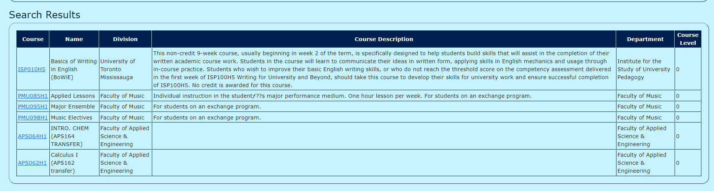

# ECE444-F2021-Lab5
# NAME: En-Mien Yang
# NOTE: this   repo   is   a   clone   of https://github.com/nelaturuk/education_pathways

# Activity 1

# Activity 2-5

# Activity 6
# The old UI and the new styled UI differ in that the new styled one utilitze bootstrap and css styling to make the interface more organized. Using containers/classes to style different elements in a page makes the page look structured and not all crampped together.